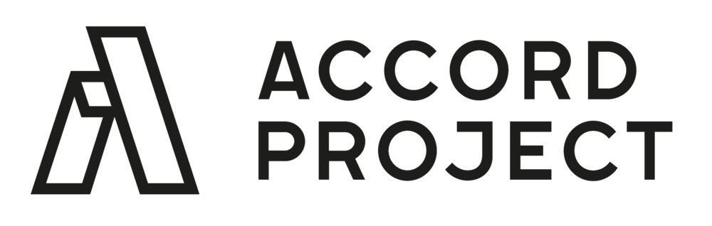

<h1 align="center">
  <a href="https://github.com/accordproject/markdown-transform">
    Markdown Transform
  <a/>
</h1>

<p align="center">
  <a href="https://coveralls.io/github/accordproject/markdown-transform?branch=master"></a>
  <a href="./LICENSE"></a>
  <a href="https://www.npmjs.com/package/@accordproject/markdown-cli"></a>
  <a href="https://badge.fury.io/js/%40accordproject%2Fmarkdown-cli"></a>
  <a href="https://accord-project-slack-signup.herokuapp.com/">
    
  </a>
</p>

### Visit the [TemplateMark Dingus](https://templatemark-dingus.netlify.app)

## Introduction

A transformation and parsing framework for converting markdown content to HTML, Slate (for rich-text editing) and other structured document object models (DOMs).


## Structure of the Code Repository

Top level repository (markdown-transform), with sub packages. Each sub-package is published as an independent npm module using `lerna`:
* [markdown-cli](https://github.com/accordproject/markdown-transform/tree/master/packages/markdown-cli) : command line utilities
* [markdown-transform](https://github.com/accordproject/markdown-transform/tree/master/packages/markdown-transform) : High-level API to transform markdown into different formats
* [markdown-common](https://github.com/accordproject/markdown-transform/tree/master/packages/markdown-common) : converts between markdown strings and the CommonMark DOM
* [markdown-cicero](https://github.com/accordproject/markdown-transform/tree/master/packages/markdown-cicero) : converts between the CommonMark DOM and the CiceroMark DOM
* [markdown-template](https://github.com/accordproject/markdown-transform/tree/master/packages/markdown-template) : converts between JSON data + markdown strings and TemplateMark
* [markdown-slate](https://github.com/accordproject/markdown-transform/tree/master/packages/markdown-slate) : converts between the CiceroMark DOM and the Slate DOM
* [markdown-html](https://github.com/accordproject/markdown-transform/tree/master/packages/markdown-html) : converts between the CiceroMark DOM and HTML
* [markdown-pdf](https://github.com/accordproject/markdown-transform/tree/master/packages/markdown-pdf) : converts between a PDF file and the CiceroMark DOM
* [markdown-docx](https://github.com/accordproject/markdown-transform/tree/master/packages/markdown-docx) : converts a DOCX file to the CiceroMark DOM
* [markdown-it-cicero](https://github.com/accordproject/markdown-transform/tree/master/packages/markdown-it-cicero) : markdown-it plugin for contracts and CiceroMark
* [markdown-it-template](https://github.com/accordproject/markdown-transform/tree/master/packages/markdown-it-template) : markdown-it plugin for templates and TemplateMark
* [dingus](https://github.com/accordproject/markdown-transform/tree/master/packages/dingus) : published tool to edit markdown as HTML or a DOM

###  CommonMark DOM

The CommonMark DOM is a model for the elements of CommonMark (the specification for markdown text), expressed as a [Concerto schema](https://github.com/accordproject/concerto), and serialized as a JSON graph.

The schema is defined here: https://models.accordproject.org/markdown/commonmark@0.2.0.html

###  CiceroMark DOM

CiceroMark defines markdown documents with embedded clauses, where each clause is an instance of a template, specified using TemplateMark.

The CiceroMark DOM extends the CommonMark DOM, defining nodes for `Clause`, `Variable` and `Formula` etc.

The schema is defined here: https://models.accordproject.org/markdown/ciceromark@0.3.0.html

###  TemplateMark DOM

TemplateMark defines markdown documents with syntax for embedded variables, optional blocks, formulas etc. It is used to define Accord Project templates.

The TemplateMark DOM extends the CommonMark DOM, defining nodes for `ClauseDefinition`, `VariableDefinition` and `ForumulaDefinition` etc.

The schema is defined here: https://models.accordproject.org/markdown/templatemark.html

###  Slate DOM

The Slate DOM is defined by the [Slate](https://www.slatejs.org) HTML content-editable WYSIWYG editing framework.

## Installation

### For users

To install the command-line interface:

```
npm install -g @accordproject/markdown-cli
```

This will install the `markus` command-line for markdown transform. To get command-line help:
```
markus --help
```

### For developers

To install for development, in the project directory, you will need to first install [lerna](https://lerna.js.org):
```
npm install -g lerna@^3.20.2
npm install
```

Then run:

```
npm run test
```

Invokes _lerna_ to run the test suite.

---

<p align="center">
  <a href="https://www.accordproject.org/">
    
  </a>
</p>

Accord Project is an open source, non-profit, initiative working to transform contract management and contract automation by digitizing contracts. Accord Project operates under the umbrella of the [Linux Foundation][linuxfound]. The technical charter for the Accord Project can be found [here][charter].

## Contributing

The Accord Project technology is being developed as open source. All the software packages are being actively maintained on GitHub and we encourage organizations and individuals to contribute requirements, documentation, issues, new templates, and code.

Find out what’s coming on our [blog][apblog].

Join the Accord Project Technology Working Group [Slack channel][apslack] to get involved!

For code contributions, read our [CONTRIBUTING guide][contributing] and information for [DEVELOPERS][developers].

### README Badge

Using Accord Project? Add a README badge to let everyone know: [](https://www.accordproject.org/)

```
[](https://www.accordproject.org/)
```

## License <a name="license"></a>

Accord Project source code files are made available under the [Apache License, Version 2.0][apache].
Accord Project documentation files are made available under the [Creative Commons Attribution 4.0 International License][creativecommons] (CC-BY-4.0).

Copyright 2018-2019 Clause, Inc. All trademarks are the property of their respective owners. See [LF Projects Trademark Policy](https://lfprojects.org/policies/trademark-policy/).

[linuxfound]: https://www.linuxfoundation.org
[charter]: https://github.com/accordproject/markdown-transform/blob/master/CHARTER.md
[apmain]: https://accordproject.org/ 
[apworkgroup]: https://calendar.google.com/calendar/event?action=TEMPLATE&tmeid=MjZvYzIzZHVrYnI1aDVzbjZnMHJqYmtwaGlfMjAxNzExMTVUMjEwMDAwWiBkYW5AY2xhdXNlLmlv&tmsrc=dan%40clause.io
[apblog]: https://medium.com/@accordhq
[apnews]: https://www.accordproject.org/news/
[apgit]:  https://github.com/accordproject/
[apdoc]: https://docs.accordproject.org/
[apslack]: https://accord-project-slack-signup.herokuapp.com

[docspec]: https://docs.accordproject.org/docs/spec-overview.html
[docwelcome]: https://docs.accordproject.org/docs/accordproject.html
[dochighlevel]: https://docs.accordproject.org/docs/spec-concepts.html
[docergo]: https://docs.accordproject.org/docs/logic-ergo.html
[docstart]: https://docs.accordproject.org/docs/accordproject.html
[doccicero]: https://docs.accordproject.org/docs/basic-use.html
[docstudio]: https://docs.accordproject.org/docs/advanced-latedelivery.html

[contributing]: https://github.com/accordproject/markdown-transform/blob/master/CONTRIBUTING.md
[developers]: https://github.com/accordproject/markdown-transform/blob/master/DEVELOPERS.md

[apache]: https://github.com/accordproject/markdown-transform/blob/master/LICENSE
[creativecommons]: http://creativecommons.org/licenses/by/4.0/
