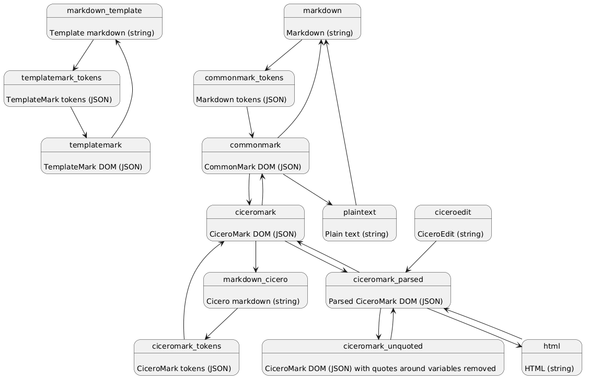

# Markdown Transform API

High-level API to transform markdown content between the various formats supported by this monorepo (CommonMark, CiceroMark, TemplateMark, HTML, plaintext, CiceroEdit, etc.).

## Installation

```
npm install @accordproject/markdown-transform
```

This package depends on `markdown-common`, `markdown-cicero`, `markdown-template` and `markdown-html`, which are pulled in automatically.

## Basic Usage

```ts
import { transform } from '@accordproject/markdown-transform';

// markdown → HTML
const html = await transform(markdown, 'markdown', ['html']);
```

The third argument is an array of destination formats. When more than one is given, the transformation is chained through each one.

```ts
// markdown → ciceromark (unquoted variables) → HTML
const html = await transform(markdown, 'markdown', ['ciceromark_unquoted', 'html']);
```

In CommonJS:

```js
const { transform } = require('@accordproject/markdown-transform');
```

## Supported formats

`markdown`, `markdown_cicero`, `markdown_template`, `commonmark_tokens`, `ciceromark_tokens`, `templatemark_tokens`, `commonmark`, `ciceromark`, `ciceromark_parsed`, `ciceromark_unquoted`, `templatemark`, `ciceroedit`, `html`, `plaintext`.

Use `formatDescriptor(name)` to inspect a format's `fileFormat` (`utf8` / `json` / `binary`) and its outgoing edges, or `new TransformEngine(builtinTransformationGraph)` to register your own formats/transforms.

## Transformation Graph

You can generate a PlantUML state diagram for the supported transformations:

```ts
import { generateTransformationDiagram } from '@accordproject/markdown-transform';
const plantUml = generateTransformationDiagram();
```



## License <a name="license"></a>
Accord Project source code files are made available under the Apache License, Version 2.0 (Apache-2.0), located in the LICENSE file. Accord Project documentation files are made available under the Creative Commons Attribution 4.0 International License (CC-BY-4.0), available at http://creativecommons.org/licenses/by/4.0/.
