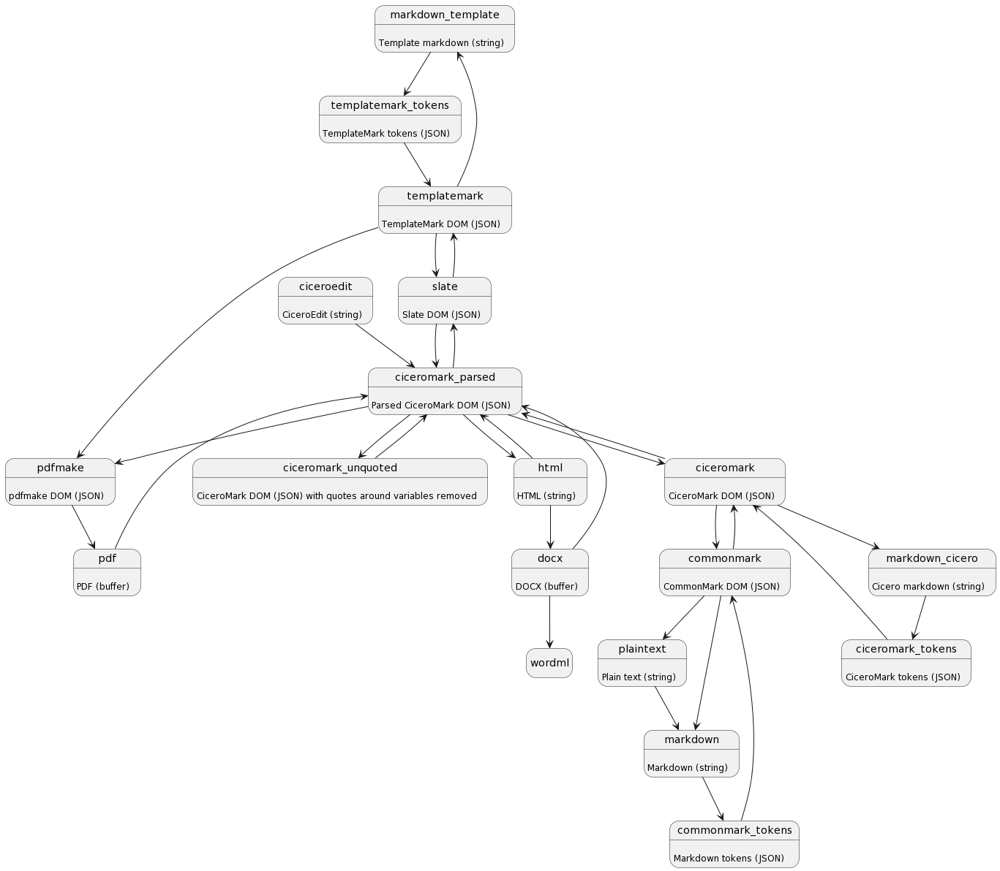

# Markdown Transform API

High-level API to transform markdown into different formats.

## Installation

```
npm install -g @accordproject/markdown-transform
```

## Usage

```
const transform = require('@accordproject/markdown-transform').transform;

// convert a markdown string to an html string
//   first argument is the markdown string to be converted
//   second argument is the source format
//   third argument is an array of destination formats to pass through
const htmlString = await transform(markdownString, 'markdown', ['html']);
console.log(htmlString);
```

Note that the call to `transform` returns a `Promise`.

## Transformation Graph

You can generate a PlantUML state diagram for the supported transformations using the followning code:

```
const generateTransformationDiagram = require('@accordproject/markdown-transform').generateTransformationDiagram;
const plantUMLStateDiagram = generateTransformationDiagram();
```



## License <a name="license"></a>
Accord Project source code files are made available under the Apache License, Version 2.0 (Apache-2.0), located in the LICENSE file. Accord Project documentation files are made available under the Creative Commons Attribution 4.0 International License (CC-BY-4.0), available at http://creativecommons.org/licenses/by/4.0/.

© 2017-2019 Clause, Inc.
